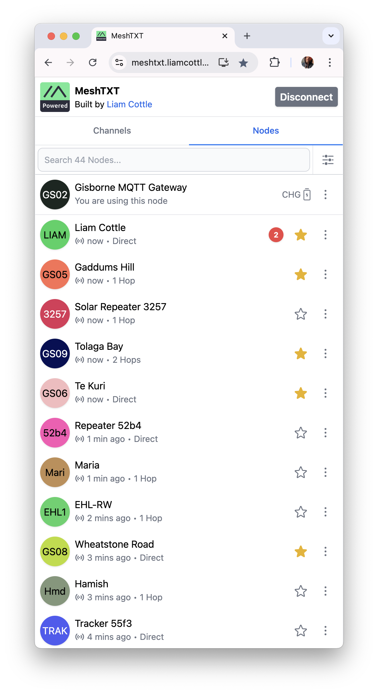
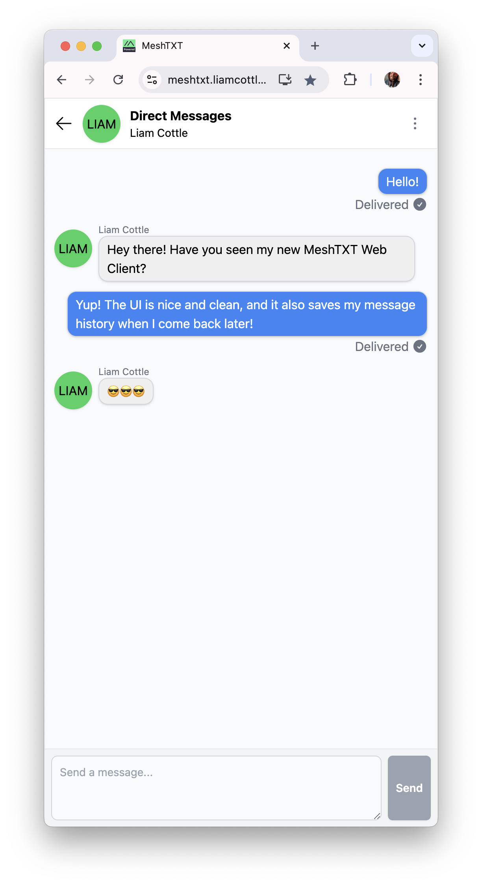
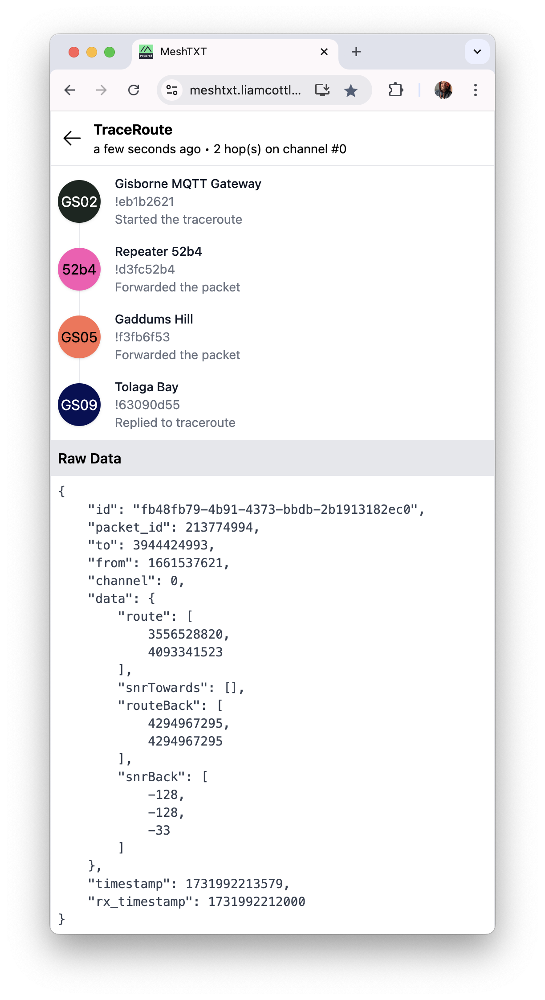

# MeshTXT

A simple, mobile friendly, web based Meshtastic client.

|Nodes | Messages | Trace Routes |
|:---:|:---:|:---:|
| |  |  |

## What can it do?

- Connect to a Meshtastic device over Bluetooth, Serial and HTTP
- Send and receive text messages on existing channels
- Send and receive direct messages with known nodes
- Send and receive node info on demand with a specific node
- Display information about a specific node
- Perform and visualise trace routes to other nodes
- Saves messages and trace routes to database so they survive page reloads
- Mark and unmark a node as a favourite
- Filter nodes to only show favourites

## Running Locally

```
git clone https://github.com/liamcottle/meshtxt
cd meshtxt
npm install
npm run dev
```

## TODO

- Show unread message indicators on channels
- Add side drawer navigation
- Save nodes to database and allow user to set a custom name/label for "anonymous" nodes
- Add NodeJS server script to run directly on Pi and connect to meshtasticd over localhost
- Add a profile/node config page to allow user to quickly update node short/long name, and maybe set lora region
- Add a full node settings page

## CORS Proxy for HTTP Connections


- The `/api/v1/fromradio` endpoint in `meshtasticd` works as expected.
- The `/api/v1/toradio` endpoint in `meshtasticd` does not return an `OPTIONS` response.

What does this mean? It means that it is possible to fetch packets from a `meshtasticd` device over HTTP, however you cannot send packets to `meshtasticd` over HTTP as the browser will reject the request due to the CORS preflight request having failed.

This could be fixed by adding the correct CORS response in `meshtasticd` code, or you can alternatively use an HTTP reverse proxy that injects the required CORS headers in all responses.

Here is an example config I use in my Caddy reverse proxy. Do note that I have omitted my TLS configuration.

```
# Meshtastic - Liam's Pi Gateway
meshtasticd.example.com {

	# always respond with these cors headers
	header Access-Control-Allow-Origin "*"
	header Access-Control-Allow-Methods "*"
	header Access-Control-Allow-Headers "*"

	# respond with http 200 for all options requests and bypass sending to meshtasticd
	@options method OPTIONS
	respond @options "" 200

	# reverse proxy to meshtasticd
	reverse_proxy https://10.1.0.123 {

		# strip existing cors headers from meshtasticd responses
		header_down -Access-Control-Allow-Origin
		header_down -Access-Control-Allow-Methods
		header_down -Access-Control-Allow-Headers

		# allow self signed cert
		transport http {
			tls
			tls_insecure_skip_verify
		}

	}

}
```

## License

MIT
